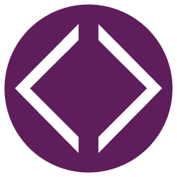

# Control Me!

A fun app made with Electron to let others control your PC.

## Setup
1. Navigate to Settings>Server in the app, and ensure that the server is started
2. Create an account at [Ngrok](https://dashboard.ngrok.com/signup)
3. Go to the [Your Authtoken](https://dashboard.ngrok.com/get-started/your-authtoken) menu in the dashboard
4. Copy the authtoken using the blue "Copy" button
5. Navigate to Settings>Ngrok in the app
6. Paste your Ngrok authtoken into the "Auth token" field
7. Navigate to the [Domains](https://dashboard.ngrok.com/cloud-edge/domains) menu in the Ngrok dashboard
8. Click "Create Domain"
9. Copy the ****.ngrok-free.app address and paste it into the "Domain" field in the app
10. Start the Ngrok tunnel
11. Navigate to the "Share" tab
12. Create a share link for your friends!
13. Have fun!

## Troubleshooting
- Errors with Ngrok usually mean that you have another instance of the app running
- If clicking the Ngrok "Start" button does nothing, ensure your server is started first
- Autorunning exes that require admin permissions will crash if you don't run the app as admin